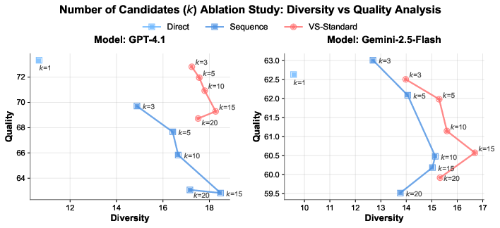
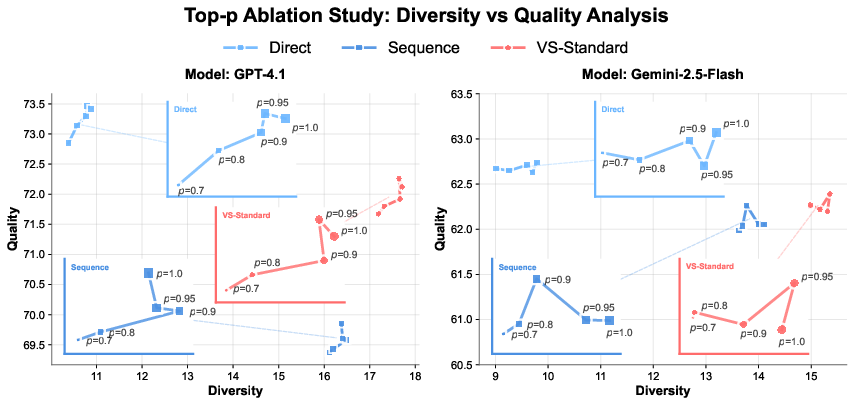
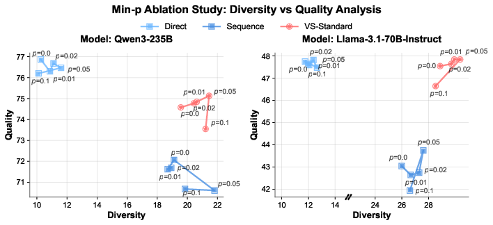

# Ablation Study

## Ablation on the Number of Candidates ($k$) in VS

**Analysis of the number of candidates ($k$) for poem generation across GPT-4.1 and Gemini-2.5-Flash.** Each plot illustrates the diversity-quality trade-off as $k$ is varied from 1 to 20. Increasing $k$ generally improves diversity but lowers quality. VS-Standard consistently provides the best trade-off compared to the two baseline, approaching the Pareto front.

We analyze the impact of the number of candidates ($k$) on the generation process. In this experiment, we vary $k$ within the set $\{1, 3, 5, 10, 15, 20\}$ for the Direct, Sequence, and VS-Standard methods, while keeping other decoding parameters fixed. The results show a trade-off: increasing the number of candidates consistently boosts diversity at the small expense of quality across all methods and models. However, VS-Standard (red) consistently establishes a better **Pareto front** than the baseline. For any given level of diversity, it maintains a higher quality score compared to both the Direct (light blue) and Sequence (blue) baselines. This indicates that our method is more effective at leveraging a larger candidate pool to find diverse yet high-quality outputs, mitigating the quality degradation typically seen when increasing $k$.

## Ablation on Decoding Strategies

This section extends the temperature ablation from Section [sec:ablation_study] to investigate the interaction between VS and two other core decoding strategies: top-p and min-p sampling.

### Top-p Sampling

**Top-p sampling analysis for poem generation across GPT-4.1 and Gemini-2.5-Flash.** The plots show the quality-diversity trade-off for varying $p$ values. VS-Standard demonstrates a superior performance, with an optimal balance often found at $p=0.95$. The inset provides a zoomed-in view of each method's performance curve.

First, we explore the interaction between our method and top-p (or nucleus) sampling by varying $p \in \{0.7, 0.8, 0.9, 0.95, 1.0\}$. As shown in the figure, the effect of top-p is more nuanced than that of temperature. For VS-Standard, we observe that **both quality and diversity increase as $p$ is raised from 0.7 to an optimal value around 0.95**, after which quality may slightly decline. This suggests a synergistic relationship, where a moderately high $p$ value allows the model to explore a richer set of high-probability tokens that VS-Standard can effectively refine into better outputs. Across both GPT-4.1 and Gemini-2.5-Flash, VS-Standard again carves out a Pareto front, demonstrating its robust compatibility with top-p sampling.

### Min-p Sampling

**Min-p sampling analysis for poem generation across Qwen3-235B and Llama-3.1-70B-Instruct.** The plots show the quality-diversity trade-off for varying min-p values. Increasing min-p enhances diversity while reducing quality. VS-Standard outperforms the baselines, establishing a much more favorable Pareto front on both open-source models.

Next, we evaluate VS-Standard in conjunction with min-p sampling, a recent technique that requires access to the model's logit distribution. Accordingly, we conduct this ablation on two powerful open-source models: Qwen3-235B and Llama-3.1-70B-Instruct, with $p \in \{0.0, 0.01, 0.02, 0.05, 0.1\}$. The figure shows the result. While the general trend of **increasing min-p boosting diversity at the small cost of quality** holds for all methods, VS-Standard achieves a much better diversity-quality trade-off compared to the baselines. This confirms the effectiveness of VS-Standard on leading open-source models and its compatibility with state-of-the-art sampling techniques.

## Ablation on Probability Definitions in VS

As shown in Section [sec:vs], prompting the model to verbalize the distribution of responses along with their corresponding probabilities allows VS to overcome the mode collapse by explicitly instructing the model to sample from its original, diverse pre-training distribution. There are multiple ways to elicit these verbalized probabilities, and we explore seven variants. For example, when prompting the model to "Generate five jokes about coffee, each response with their corresponding probability. The probability is defined as [probability_definition]", we will fill in the following probability definition:

- **Implicit probability (Implicit)**: "how likely this response would be (from 0.0 to 1.0)", which mentions the full distribution only implicitly;
- **Explicit probability (Explicit)**: "the estimated probability from 0.0 to 1.0 of this response given the input prompt (relative to the full distribution)", which mentions the full distribution explicitly;
- **Relative probability (Relative)**: "the probability between 0.0 and 1.0, reflecting the relative likelihood of this response given the input.";
- **Percentage probability (Percentage)**: "the probability of this response relative to the full distribution, expressed as a percentage from 0% to 100%";
- **Confidence**: "the normalized likelihood score between 0.0 and 1.0 that indicates how representative or typical this response is compared to the full distribution";
- **Perplexity**: "the exponentiated average negative log likelihood of the response tokens, where lower values indicate higher model certainty in predicting each token";
- **Negative Log-likelihood (NLL)**: "the sum of the negative log probabilities of each token in the response given the input prompt, with smaller values reflecting higher model confidence".

The VS prompt can be found in Appendix [appendix:experiment_prompt], where the definition in the probability field can be replaced with the exact definition provided above. We conduct an ablation study on these format of verbalize probability on two tasks: poem continuation (a creative writing task) and open-ended QA. We selected these tasks because poem continuation has an unlimited answer space, whereas open-ended QA has a more constrained answer space. This allows us to examine how different forms of verbalized probability affect performance across varying output spaces.

**Ablation of probability formats for VS on the Poem Continuation Task.** We evaluate VS-Standard (blue) and VS-Multi (red) on two models across two metrics: **(a, c)** Diversity ($\uparrow$) and **(b, d)** Quality ($\uparrow$). Subplots **a–b** report results on GPT-4.1, while **c-d** show results on Gemini 2.5 Flash. Prompt formats include Implicit, Explicit, Relative, Percentage, Confidence, NLL, and Perplexity.

**Ablation of probability formats for VS on the Open-Ended QA Task.** We evaluate VS-Standard (blue) and VS-Multi (red) on two models across three metrics: **(a, d)** KL Divergence (↓), **(b, e)** Coverage-N (↑), and **(c, f)** Precision (↑). Subplots **a–c** report results on GPT-4.1, while **d–f** show results on Gemini 2.5 Flash.

### Results and Analysis

As shown in the first figure (a–d), both VS-Standard and VS-Multi outperform the baselines in terms of diversity on GPT-4.1 and Gemini-2.5-Flash. Across probability formats, we observe no significant overall advantage of one format over another. For both models, VS-Standard tends to perform best with _Explicit_, while VS-Multi generally benefits more from _Confidence_. In terms of quality, differences across formats remain small, with VS-Multi showing a slight overall advantage over VS-Standard.

For open-ended QA (second figure a–f), VS-Standard (blue) shows limited variance across probability formats, with _Explicit_ performing slightly better on KL Divergence and Coverage-N. VS-Multi (red), in contrast, benefits more consistently from _Explicit_ and _Confidence_, though other formats are less stable. Precision under VS-Standard remains stable across formats, while VS-Multi exhibits greater sensitivity, particularly on Gemini-2.5-Flash.

Overall, we find that VS-Standard tends to benefit most from the _Explicit probability_ format, while VS-Multi often prefers _Confidence_. However, these preferences vary by model, and no single format provides a universally significant improvement. This suggests that although explicit grounding of likelihood values is often beneficial, the optimal probability format should be adapted to the model and task.

## Ablation on Probability Tuning in VS on Creative Writing

One advantage of VS over baseline methods is that we can potentially change the diversity level by tuning the probability in VS (e.g., "sample from tail distribution, where each response should be < p%").

###
