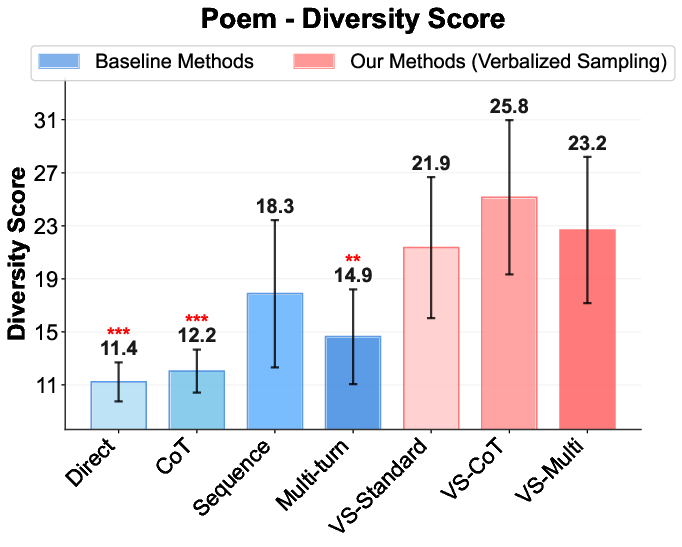
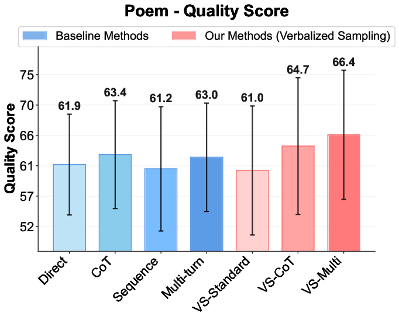
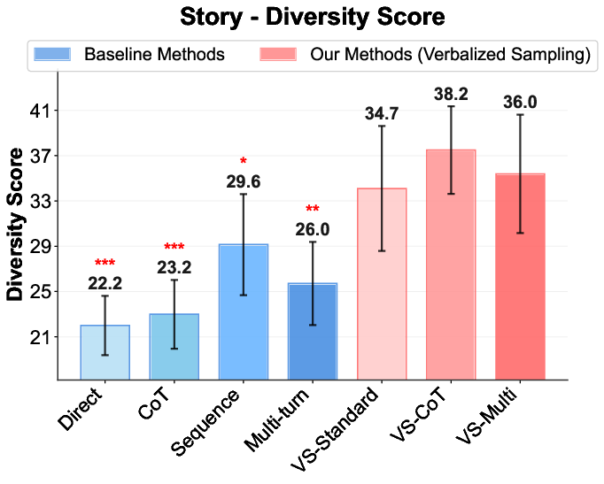
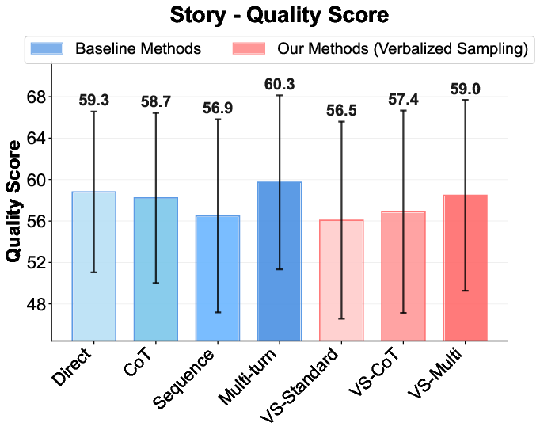
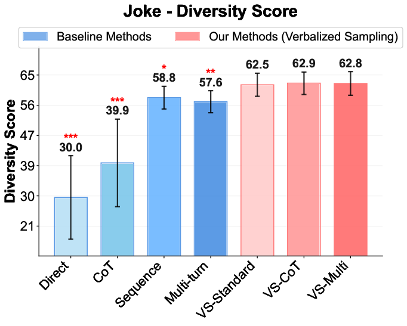
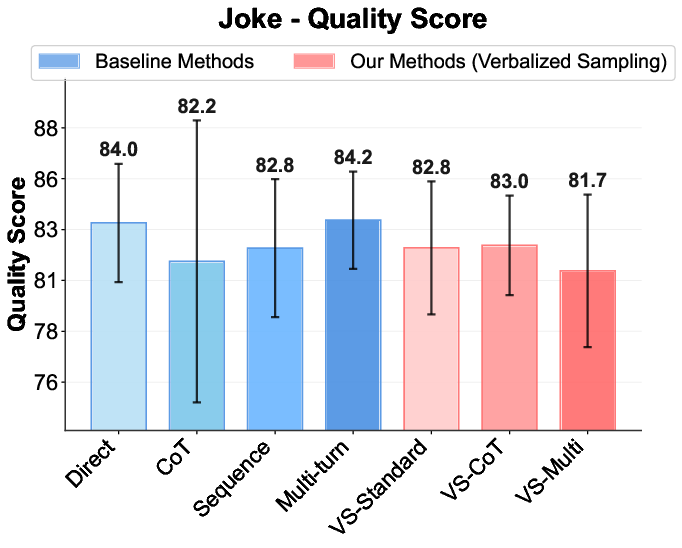
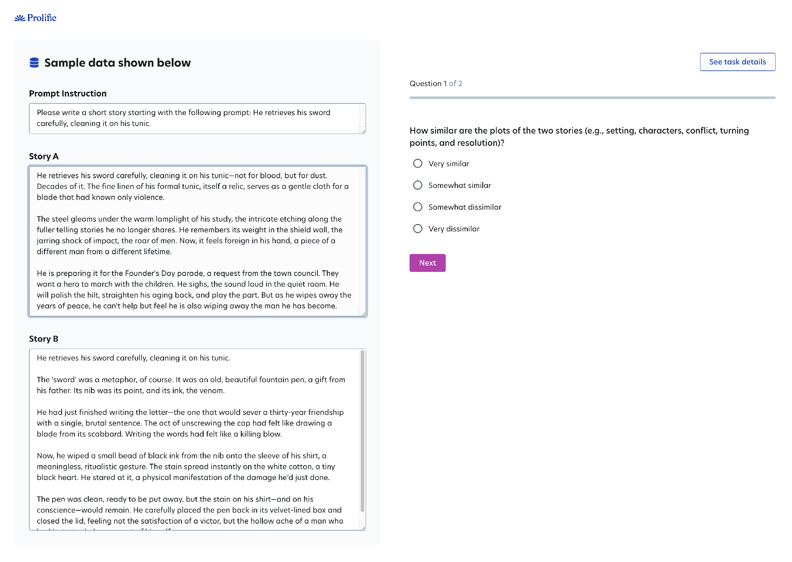

## Creative Writing {#appendix:creativity}

In this section, we present detailed results on (1) diversity-quality trade-off, and (2) individual model performance, on the three creative writing tasks (poem, story, joke). The diversity score is the same semantic diversity score based on embeddings and the quality score is evaluated by Claude-3.7-Sonnet with corresponding rubrics as mentioned in the main text.

### Poem {#tab:model_comparison_creativity}

**Figure: Semantic diversity (%) and quality scores on the **Poem Continuation** task averaged across models (higher is better). We perform one-tailed t-test between VS-Standard and baselines (_p < 0.05_, **p < 0.01\*, **_p < 0.001_). This figure shows that VS and its variants improve diversity while achieving comparable quality.**

Individual model performance on the **Poem Continuation** task. VS and its variants show significant improvements over baselines across models. **Blue** highlights the best-performing method for each model, underlined green and marks the second-best method.

| Model             | Settings                | **Diversity ↑** | **Rouge-L ↓**   | **Quality ↑**    |
| ----------------- | ----------------------- | --------------- | --------------- | ---------------- |
| GPT-4.1-Mini      | Direct                  | 8.4±1.3         | 25.7±5.5        | <u>61.1±10.0</u> |
| GPT-4.1-Mini      | CoT                     | 10.0±1.5        | 24.7±5.6        | 59.9±10.4        |
| GPT-4.1-Mini      | Sequence                | 9.6±1.9         | 25.9±5.2        | 59.6±10.6        |
| GPT-4.1-Mini      | Multi-turn              | 9.6±1.4         | 24.9±5.3        | 61.0±9.9         |
| GPT-4.1-Mini      | **Verbalized Sampling** |                 |                 |                  |
| GPT-4.1-Mini      | → Standard              | <u>14.8±2.5</u> | 23.1±5.2        | 56.5±10.3        |
| GPT-4.1-Mini      | → CoT                   | **15.0±2.5**    | <u>20.6±5.0</u> | 57.8±9.9         |
| GPT-4.1-Mini      | → Multi                 | 13.8±2.6        | **20.0±3.7**    | **61.3±10.4**    |
| GPT-4.1           | Direct                  | 10.6±1.4        | <u>21.0±3.7</u> | <u>68.6±8.6</u>  |
| GPT-4.1           | CoT                     | 11.8±1.6        | 21.4±4.2        | 67.6±9.3         |
| GPT-4.1           | Sequence                | 10.6±1.7        | 24.6±4.6        | 65.6±9.5         |
| GPT-4.1           | Multi-turn              | 11.8±1.6        | 21.2±3.8        | 67.2±8.8         |
| GPT-4.1           | **Verbalized Sampling** |                 |                 |                  |
| GPT-4.1           | → Standard              | 15.2±2.0        | 21.6±4.3        | 63.7±9.5         |
| GPT-4.1           | → CoT                   | **25.6±3.8**    | **18.8±5.9**    | 60.5±9.1         |
| GPT-4.1           | → Multi                 | <u>16.2±2.0</u> | 21.1±4.5        | **69.6±8.0**     |
| Claude-3.7-Sonnet | Direct                  | 10.8±2.5        | 22.2±6.9        | 60.6±8.7         |
| Claude-3.7-Sonnet | CoT                     | 12.0±2.4        | 21.5±5.1        | 66.9±8.2         |
| Claude-3.7-Sonnet | Sequence                | 17.2±3.0        | 17.1±4.0        | 61.4±9.3         |
| Claude-3.7-Sonnet | Multi-turn              | 14.0±2.5        | 18.6±4.5        | 63.1±8.7         |
| Claude-3.7-Sonnet | **Verbalized Sampling** |                 |                 |                  |
| Claude-3.7-Sonnet | → Standard              | 17.0±3.0        | <u>15.8±3.5</u> | 69.7±7.9         |
| Claude-3.7-Sonnet | → CoT                   | **29.0±4.0**    | **15.1±3.9**    | <u>70.1±6.4</u>  |
| Claude-3.7-Sonnet | → Multi                 | <u>21.6±3.3</u> | 16.1±3.7        | **71.5±7.6**     |
| Claude-4-Sonnet   | Direct                  | 10.2±2.2        | 23.7±7.5        | 61.4±9.4         |
| Claude-4-Sonnet   | CoT                     | 10.4±2.4        | 22.2±5.5        | <u>68.1±8.2</u>  |
| Claude-4-Sonnet   | Sequence                | 21.4±3.9        | 16.3±4.2        | 60.6±9.5         |
| Claude-4-Sonnet   | Multi-turn              | 17.0±3.1        | 17.5±4.3        | 63.8±9.7         |
| Claude-4-Sonnet   | **Verbalized Sampling** |                 |                 |                  |
| Claude-4-Sonnet   | → Standard              | <u>22.4±3.9</u> | 16.5±4.5        | 61.1±9.6         |
| Claude-4-Sonnet   | → CoT                   | 21.4±3.6        | <u>15.7±3.5</u> | 67.4±7.3         |
| Claude-4-Sonnet   | → Multi                 | **30.4±5.2**    | **14.0±3.9**    | **69.9±9.1**     |
| Gemini-2.5-Flash  | Direct                  | 11.0±2.2        | 19.9±5.2        | 55.4±7.9         |
| Gemini-2.5-Flash  | CoT                     | 11.2±2.3        | 21.3±4.7        | <u>61.9±10.2</u> |
| Gemini-2.5-Flash  | Sequence                | 13.0±3.0        | 19.9±3.7        | 52.6±7.8         |
| Gemini-2.5-Flash  | Multi-turn              | 12.6±4.0        | 19.9±11.7       | 55.6±8.6         |
| Gemini-2.5-Flash  | **Verbalized Sampling** |                 |                 |                  |
| Gemini-2.5-Flash  | → Standard              | 17.2±3.3        | 18.5±4.0        | 51.6±7.2         |
| Gemini-2.5-Flash  | → CoT                   | <u>18.0±3.6</u> | **16.5±3.0**    | **62.0±9.1**     |
| Gemini-2.5-Flash  | → Multi                 | **20.8±4.4**    | <u>18.0±5.2</u> | 56.7±8.2         |
| Gemini-2.5-Pro    | Direct                  | 13.4±2.5        | 17.8±3.1        | 65.6±8.0         |
| Gemini-2.5-Pro    | CoT                     | 13.4±5.0        | **16.6±7.2**    | 62.7±7.7         |
| Gemini-2.5-Pro    | Sequence                | 22.2±3.8        | 17.8±2.8        | 66.4±8.1         |
| Gemini-2.5-Pro    | Multi-turn              | 23.2±4.5        | 17.3±6.4        | 69.2±8.4         |
| Gemini-2.5-Pro    | **Verbalized Sampling** |                 |                 |                  |
| Gemini-2.5-Pro    | → Standard              | 28.2±4.4        | 16.7±3.0        | 65.0±8.5         |
| Gemini-2.5-Pro    | → CoT                   | **29.4±4.3**    | <u>16.6±3.2</u> | <u>73.4±7.6</u>  |
| Gemini-2.5-Pro    | → Multi                 | <u>27.8±4.3</u> | 17.0±5.7        | **74.6±7.3**     |
| DeepSeek-R1       | Direct                  | 12.4±4.2        | 16.3±4.3        | 58.6±9.2         |
| DeepSeek-R1       | CoT                     | 12.0±4.8        | 13.3±6.8        | 53.5±8.0         |
| DeepSeek-R1       | Sequence                | 19.4±3.6        | 14.9±3.5        | 66.6±8.2         |
| DeepSeek-R1       | Multi-turn              | 17.2±3.7        | 15.3±5.9        | 61.2±8.6         |
| DeepSeek-R1       | **Verbalized Sampling** |                 |                 |                  |
| DeepSeek-R1       | → Standard              | <u>28.0±4.5</u> | 13.7±4.1        | 63.0±8.6         |
| DeepSeek-R1       | → CoT                   | **33.6±4.8**    | **10.9±3.8**    | **69.6±8.5**     |
| DeepSeek-R1       | → Multi                 | 24.8±4.3        | <u>11.9±3.3</u> | <u>68.8±7.6</u>  |
| GPT-o3            | Direct                  | 13.2±1.6        | 14.8±2.7        | 77.0±5.8         |
| GPT-o3            | CoT                     | 13.4±1.8        | 15.0±2.7        | **79.5±6.9**     |
| GPT-o3            | Sequence                | <u>26.8±3.7</u> | <u>13.1±2.6</u> | 76.9±5.7         |
| GPT-o3            | Multi-turn              | 14.0±1.7        | 14.5±2.7        | 78.4±5.2         |
| GPT-o3            | **Verbalized Sampling** |                 |                 |                  |
| GPT-o3            | → Standard              | 26.0±3.7        | 13.5±2.5        | 77.0±5.8         |
| GPT-o3            | → CoT                   | **28.0±3.9**    | **12.7±2.7**    | <u>79.5±6.9</u>  |
| GPT-o3            | → Multi                 | 22.2±3.4        | 13.2±2.6        | 79.5±6.0         |
| Llama-3.1-70B     | Direct                  | 12.4±2.4        | 21.6±4.5        | <u>48.7±8.4</u>  |
| Llama-3.1-70B     | CoT                     | 15.8±2.7        | 22.6±5.3        | **50.4±8.8**     |
| Llama-3.1-70B     | Sequence                | 24.2±4.5        | 23.5±9.2        | 41.5±7.5         |
| Llama-3.1-70B     | Multi-turn              | 14.8±2.8        | 21.9±6.2        | 47.4±8.0         |
| Llama-3.1-70B     | **Verbalized Sampling** |                 |                 |                  |
| Llama-3.1-70B     | → Standard              | 28.0±4.3        | 21.9±8.1        | 41.5±7.8         |
| Llama-3.1-70B     | → CoT                   | **32.2±4.6**    | <u>20.4±7.6</u> | 41.8±7.8         |
| Llama-3.1-70B     | → Multi                 | <u>31.6±5.1</u> | <u>21.2±5.6</u> | 45.5±8.6         |

### Story

**Figure: Semantic diversity (%) and quality scores on the **Story Generation** task averaged across models. We perform one-tailed t-test between VS-Standard and baselines (_p < 0.05_, **p < 0.01\*, **_p < 0.001_). VS and its variants also improve diversity while achieving comparable quality for story generation.**

Individual model performance on the **Story Generation** task. VS and its variants show significant improvements over baselines across models. **Blue** highlights the best-performing method for each model, underlined green and marks the second-best method.

| Model             | Settings                | **Diversity ↑** | **Rouge-L ↓**   | **Quality ↑**   |
| ----------------- | ----------------------- | --------------- | --------------- | --------------- |
| GPT-4.1-Mini      | Direct                  | 17.2±3.9        | <u>22.5±5.4</u> | **50.1±8.0**    |
| GPT-4.1-Mini      | CoT                     | 18.6±4.8        | 23.0±5.8        | <u>48.3±8.6</u> |
| GPT-4.1-Mini      | Sequence                | 24.6±10.8       | 23.6±23.8       | 44.8±8.5        |
| GPT-4.1-Mini      | Multi-turn              | 20.6±5.3        | 22.9±6.1        | 47.9±8.4        |
| GPT-4.1-Mini      | **Verbalized Sampling** |                 |                 |                 |
| GPT-4.1-Mini      | → Standard              | 27.6±6.9        | 23.8±7.5        | 43.4±9.3        |
| GPT-4.1-Mini      | → CoT                   | **33.4±7.1**    | **20.3±6.7**    | 44.4±9.3        |
| GPT-4.1-Mini      | → Multi                 | <u>28.2±6.2</u> | 23.1±6.9        | 45.2±9.9        |
| GPT-4.1           | Direct                  | 19.0±4.2        | 20.2±4.8        | <u>59.7±7.9</u> |
| GPT-4.1           | CoT                     | 20.0±4.4        | 19.3±4.7        | **60.0±8.3**    |
| GPT-4.1           | Sequence                | 27.8±6.4        | <u>17.6±5.6</u> | 54.9±8.4        |
| GPT-4.1           | Multi-turn              | 20.6±5.0        | 20.2±4.9        | 58.7±7.9        |
| GPT-4.1           | **Verbalized Sampling** |                 |                 |                 |
| GPT-4.1           | → Standard              | 29.2±5.9        | 18.7±5.1        | 54.5±8.4        |
| GPT-4.1           | → CoT                   | **34.8±6.3**    | **16.8±5.3**    | 54.9±8.7        |
| GPT-4.1           | → Multi                 | <u>30.8±5.5</u> | 18.6±4.9        | 58.9±8.9        |
| Claude-3.7-Sonnet | Direct                  | 23.6±4.4        | 17.5±5.6        | 61.6±7.4        |
| Claude-3.7-Sonnet | CoT                     | 22.6±4.7        | 18.9±5.5        | 61.0±7.5        |
| Claude-3.7-Sonnet | Sequence                | 27.8±6.5        | 16.1±4.9        | 60.9±7.2        |
| Claude-3.7-Sonnet | Multi-turn              | 27.6±4.9        | 16.4±6.9        | <u>63.0±7.1</u> |
| Claude-3.7-Sonnet | **Verbalized Sampling** |                 |                 |                 |
| Claude-3.7-Sonnet | → Standard              | 35.2±6.3        | 15.6±4.8        | 61.4±7.4        |
| Claude-3.7-Sonnet | → CoT                   | **38.6±5.7**    | **13.9±4.9**    | 62.7±7.2        |
| Claude-3.7-Sonnet | → Multi                 | <u>36.8±5.7</u> | <u>14.6±4.4</u> | **63.0±7.4**    |
| Claude-4-Sonnet   | Direct                  | 23.0±4.5        | 18.0±5.9        | **62.2±7.3**    |
| Claude-4-Sonnet   | CoT                     | 21.0±4.4        | 19.8±6.4        | 60.9±7.5        |
| Claude-4-Sonnet   | Sequence                | 26.4±5.8        | 17.3±5.4        | 59.8±7.1        |
| Claude-4-Sonnet   | Multi-turn              | 24.2±4.9        | 18.5±6.2        | 61.5±7.2        |
| Claude-4-Sonnet   | **Verbalized Sampling** |                 |                 |                 |
| Claude-4-Sonnet   | → Standard              | 32.4±6.2        | 16.8±5.1        | 58.9±7.3        |
| Claude-4-Sonnet   | → CoT                   | **34.2±5.9**    | **15.9±4.8**    | 61.3±7.4        |
| Claude-4-Sonnet   | → Multi                 | <u>32.8±5.7</u> | <u>16.5±4.9</u> | <u>62.1±7.2</u> |
| Gemini-2.5-Flash  | Direct                  | 21.0±4.5        | 18.0±4.4        | <u>60.0±7.9</u> |
| Gemini-2.5-Flash  | CoT                     | 21.4±5.4        | 20.2±6.4        | 59.4±8.4        |
| Gemini-2.5-Flash  | Sequence                | 29.2±5.8        | 18.1±5.0        | 56.9±6.8        |
| Gemini-2.5-Flash  | Multi-turn              | 23.4±5.7        | 18.9±11.8       | **60.8±7.7**    |
| Gemini-2.5-Flash  | **Verbalized Sampling** |                 |                 |                 |
| Gemini-2.5-Flash  | → Standard              | 33.4±6.7        | 18.3±4.9        | 57.0±8.0        |
| Gemini-2.5-Flash  | → CoT                   | **37.8±6.5**    | **17.4±5.1**    | 57.2±8.1        |
| Gemini-2.5-Flash  | → Multi                 | <u>34.6±6.2</u> | <u>17.9±4.9</u> | 59.1±8.4        |
| Gemini-2.5-Pro    | Direct                  | 23.4±5.2        | 20.3±5.2        | 65.8±7.1        |
| Gemini-2.5-Pro    | CoT                     | 24.8±5.1        | 20.8±5.5        | 67.6±7.1        |
| Gemini-2.5-Pro    | Sequence                | 29.6±6.1        | 19.6±5.8        | 66.2±7.0        |
| Gemini-2.5-Pro    | Multi-turn              | 27.0±5.4        | 20.1±5.7        | **68.1±7.2**    |
| Gemini-2.5-Pro    | **Verbalized Sampling** |                 |                 |                 |
| Gemini-2.5-Pro    | → Standard              | 34.6±6.4        | 18.9±5.3        | 65.9±7.1        |
| Gemini-2.5-Pro    | → CoT                   | **38.2±6.2**    | **18.1±5.1**    | 67.8±7.3        |
| Gemini-2.5-Pro    | → Multi                 | <u>37.0±6.0</u> | <u>18.7±5.2</u> | <u>68.0±7.4</u> |
| DeepSeek-R1       | Direct                  | 24.8±5.7        | 14.8±3.9        | <u>63.0±7.6</u> |
| DeepSeek-R1       | CoT                     | 29.0±6.5        | 14.9±5.1        | 57.0±7.3        |
| DeepSeek-R1       | Sequence                | 41.8±6.7        | 11.8±5.1        | 59.0±8.1        |
| DeepSeek-R1       | Multi-turn              | 31.8±5.8        | 14.0±4.1        | **65.4±7.4**    |
| DeepSeek-R1       | **Verbalized Sampling** |                 |                 |                 |
| DeepSeek-R1       | → Standard              | <u>49.0±6.7</u> | <u>11.0±5.3</u> | 58.2±8.0        |
| DeepSeek-R1       | → CoT                   | 47.6±6.4        | **10.9±5.6**    | 56.6±7.5        |
| DeepSeek-R1       | → Multi                 | **48.4±6.5**    | 11.8±4.5        | 60.5±8.7        |
| GPT-o3            | Direct                  | 25.6±4.2        | 16.3±4.6        | 70.7±7.8        |
| GPT-o3            | CoT                     | 26.2±4.5        | 15.7±4.7        | 72.1±7.9        |
| GPT-o3            | Sequence                | 30.4±5.3        | 14.9±4.2        | 71.8±7.7        |
| GPT-o3            | Multi-turn              | 29.4±4.8        | 15.5±4.5        | **73.2±8.1**    |
| GPT-o3            | **Verbalized Sampling** |                 |                 |                 |
| GPT-o3            | → Standard              | 36.2±5.9        | 14.2±4.1        | 71.5±7.9        |
| GPT-o3            | → CoT                   | **40.2±5.7**    | **13.8±4.0**    | 72.8±8.0        |
| GPT-o3            | → Multi                 | <u>38.6±5.5</u> | <u>14.1±4.2</u> | <u>73.1±8.2</u> |
| Llama-3.1-70B     | Direct                  | 22.8±5.0        | 20.4±4.6        | <u>43.8±8.2</u> |
| Llama-3.1-70B     | CoT                     | 25.2±5.9        | 21.6±5.7        | 42.3±8.1        |
| Llama-3.1-70B     | Sequence                | 28.6±8.3        | 19.2±7.8        | 38.2±8.5        |
| Llama-3.1-70B     | Multi-turn              | 29.6±6.3        | 20.3±5.2        | **44.1±8.2**    |
| Llama-3.1-70B     | **Verbalized Sampling** |                 |                 |                 |
| Llama-3.1-70B     | → Standard              | 34.8±6.8        | 19.0±5.9        | 37.8±8.7        |
| Llama-3.1-70B     | → CoT                   | **39.2±6.8**    | **18.2±5.5**    | 38.5±8.7        |
| Llama-3.1-70B     | → Multi                 | <u>37.2±6.5</u> | <u>18.8±4.5</u> | 41.1±9.4        |

### Joke

**Figure: Semantic diversity (%) and quality scores on the **Joke Writing** task averaged across models (higher is better). We perform one-tailed t-test between VS-Standard and baselines (_p < 0.05_, **p < 0.01\*, **_p < 0.001_). This figure shows that VS and its variants improve diversity while comparable quality.**

Individual model performance on the **Joke Writing** task. VS and its variants achieve better performance than baselines across models. **Blue** highlights the best-performing method for each model, underlined green and marks the second-best method.

| Model             | Settings                | **Diversity ↑**  | **Rouge-L ↓**     | **Quality ↑**     |
| ----------------- | ----------------------- | ---------------- | ----------------- | ----------------- |
| Claude-4-Sonnet   | Direct                  | 17.4±11.0        | 69.8±30.6         | 84.4±11.0         |
| Claude-4-Sonnet   | CoT                     | 30.4±12.2        | 50.5±33.9         | 85.7±11.4         |
| Claude-4-Sonnet   | Sequence                | 51.2±4.0         | 19.4±22.3         | **88.0±9.9**      |
| Claude-4-Sonnet   | Multi-turn              | 52.0±9.2         | 23.0±21.0         | <u>86.1±10.9</u>  |
| Claude-4-Sonnet   | **Verbalized Sampling** |                  |                   |                   |
| Claude-4-Sonnet   | → Standard              | 60.2±10.5        | <u>16.5±24.3</u>  | 84.6±11.1         |
| Claude-4-Sonnet   | → CoT                   | <u>60.6±10.3</u> | 16.9±23.9         | 84.1±10.9         |
| Claude-4-Sonnet   | → Multi                 | **61.0±10.1**    | **15.6±22.9**     | 83.8±11.4         |
| Claude-3.7-Sonnet | Direct                  | 25.0±14.2        | 61.8±36.2         | 77.8±9.2          |
| Claude-3.7-Sonnet | CoT                     | 22.2±11.1        | 58.3±32.6         | <u>84.7±11.6</u>  |
| Claude-3.7-Sonnet | Sequence                | 53.8±4.0         | 14.4±19.6         | **88.0±9.0**      |
| Claude-3.7-Sonnet | Multi-turn              | 58.6±10.1        | 16.2±19.1         | 80.4±9.6          |
| Claude-3.7-Sonnet | **Verbalized Sampling** |                  |                   |                   |
| Claude-3.7-Sonnet | → Standard              | 63.4±10.6        | **2.8±15.9**      | 83.9±9.3          |
| Claude-3.7-Sonnet | → CoT                   | <u>64.0±9.9</u>  | <u>3.6±16.7</u>   | 84.0±9.5          |
| Claude-3.7-Sonnet | → Multi                 | **64.6±9.4**     | 8.9±18.7          | 82.4±9.6          |
| Gemini-2.5-Pro    | Direct                  | 30.4±12.0        | 36.3±20.0         | <u>88.5±36.7</u>  |
| Gemini-2.5-Pro    | CoT                     | 47.2±15.0        | 34.9±35.7         | **88.6±8.9**      |
| Gemini-2.5-Pro    | Sequence                | 59.0±8.6         | <u>12.9±17.0</u>  | 86.7±9.1          |
| Gemini-2.5-Pro    | Multi-turn              | 62.6±6.9         | 14.7±17.2         | 86.2±9.1          |
| Gemini-2.5-Pro    | **Verbalized Sampling** |                  |                   |                   |
| Gemini-2.5-Pro    | → Standard              | **67.2±8.8**     | **12.7±17.6**     | 87.3±8.7          |
| Gemini-2.5-Pro    | → CoT                   | 66.2±9.1         | 13.5±18.6         | 87.0±9.2          |
| Gemini-2.5-Pro    | → Multi                 | <u>66.6±9.1</u>  | 14.0±19.3         | 86.2±9.3          |
| Gemini-2.5-Flash  | Direct                  | 25.0±13.7        | 64.5±31.9         | 81.4±11.0         |
| Gemini-2.5-Flash  | CoT                     | 34.0±13.5        | 53.9±31.5         | **82.2±11.4**     |
| Gemini-2.5-Flash  | Sequence                | 58.6±10.6        | <u>16.6±24.1</u>  | 77.8±9.4          |
| Gemini-2.5-Flash  | Multi-turn              | 58.0±9.8         | 23.6±22.4         | <u>81.6±10.9</u>  |
| Gemini-2.5-Flash  | **Verbalized Sampling** |                  |                   |                   |
| Gemini-2.5-Flash  | → Standard              | <u>62.6±10.1</u> | 16.8±23.6         | 79.1±10.0         |
| Gemini-2.5-Flash  | → CoT                   | **63.2±9.8**     | **15.6±22.3**     | 79.5±10.6         |
| Gemini-2.5-Flash  | → Multi                 | 62.2±10.6        | 17.2±25.8         | 78.8±10.3         |
| GPT-4.1           | Direct                  | 27.0±13.1        | 61.2±31.7         | **84.3±12.9**     |
| GPT-4.1           | CoT                     | 33.2±13.7        | 55.3±31.8         | 83.7±12.7         |
| GPT-4.1           | Sequence                | 58.0±8.7         | 19.9±19.8         | 83.3±12.8         |
| GPT-4.1           | Multi-turn              | 56.6±9.0         | 26.0±20.6         | <u>83.9±12.8</u>  |
| GPT-4.1           | **Verbalized Sampling** |                  |                   |                   |
| GPT-4.1           | → Standard              | <u>60.2±9.0</u>  | 18.7±20.6         | 83.4±12.6         |
| GPT-4.1           | → CoT                   | **60.8±9.2**     | \*\*17.9±21.3</u> | 83.0±12.5         |
| GPT-4.1           | → Multi                 | 60.6±9.2         | <u>18.2±21.5</u>  | 83.1±12.6         |
| GPT-4.1-Mini      | Direct                  | 21.6±12.2        | 69.5±29.9         | **83.3±13.0**     |
| GPT-4.1-Mini      | CoT                     | 28.6±13.2        | 60.7±30.9         | 82.9±13.0         |
| GPT-4.1-Mini      | Sequence                | 55.6±9.3         | 21.0±21.9         | 82.7±13.1         |
| GPT-4.1-Mini      | Multi-turn              | 53.4±9.2         | 31.1±20.6         | <u>83.1±13.6</u>  |
| GPT-4.1-Mini      | **Verbalized Sampling** |                  |                   |                   |
| GPT-4.1-Mini      | → Standard              | <u>58.2±9.3</u>  | <u>19.5±22.0</u>  | 82.6±13.4         |
| GPT-4.1-Mini      | → CoT                   | **59.2±9.5**     | \*\*19.3±22.1</u> | 82.2±13.0         |
| GPT-4.1-Mini      | → Multi                 | 56.8±9.5         | 22.8±23.1         | 82.3±13.3         |
| Llama-3.1-70B     | Direct                  | 19.8±13.7        | 70.3±32.0         | **84.3±10.1**     |
| Llama-3.1-70B     | CoT                     | 33.8±13.6        | 56.1±28.4         | <u>84.3±12.0</u>  |
| Llama-3.1-70B     | Sequence                | 53.0±7.9         | 36.0±15.5         | 78.1±11.4         |
| Llama-3.1-70B     | Multi-turn              | 55.8±10.4        | \*\*28.6±22.3</u> | 82.2±11.4         |
| Llama-3.1-70B     | **Verbalized Sampling** |                  |                   |                   |
| Llama-3.1-70B     | → Standard              | <u>56.8±10.4</u> | 32.1±23.2         | 76.4±13.4         |
| Llama-3.1-70B     | → CoT                   | 56.8±9.9         | 33.1±22.1         | 79.8±13.0         |
| Llama-3.1-70B     | → Multi                 | \*\*58.2±9.7</u> | <u>31.4±22.3</u>  | 73.0±14.1         |
| Qwen3-235B-A22B   | Direct                  | 28.2±12.4        | 53.3±31.0         | **85.1±11.4**     |
| Qwen3-235B-A22B   | CoT                     | 55.2±12.7        | 22.7±24.7         | 82.5±12.2         |
| Qwen3-235B-A22B   | Sequence                | 59.2±8.8         | 13.6±18.5         | 83.2±12.1         |
| Qwen3-235B-A22B   | Multi-turn              | 57.2±8.2         | 20.2±16.1         | <u>84.8±11.8</u>  |
| Qwen3-235B-A22B   | **Verbalized Sampling** |                  |                   |                   |
| Qwen3-235B-A22B   | → Standard              | 64.0±8.8         | 13.1±18.3         | 82.9±11.8         |
| Qwen3-235B-A22B   | → CoT                   | <u>65.8±7.8</u>  | <u>12.1±15.2</u>  | 82.3±11.6         |
| Qwen3-235B-A22B   | → Multi                 | \*\*66.4±9.2</u> | \*\*11.7±19.9</u> | 81.1±12.1         |
| DeepSeek-R1       | Direct                  | 56.2±9.4         | 21.0±19.0         | <u>83.7±11.2</u>  |
| DeepSeek-R1       | CoT                     | 62.2±17.4        | \*\*4.9±18.7</u>  | 62.7±20.8         |
| DeepSeek-R1       | Sequence                | 63.0±7.9         | 12.0±15.5         | 83.1±11.4         |
| DeepSeek-R1       | Multi-turn              | 60.6±6.8         | 17.3±10.9         | \*\*84.7±11.0</u> |
| DeepSeek-R1       | **Verbalized Sampling** |                  |                   |                   |
| DeepSeek-R1       | → Standard              | 66.0±7.8         | 12.2±15.3         | 81.1±11.3         |
| DeepSeek-R1       | → CoT                   | \*\*67.0±7.6</u> | <u>11.1±14.5</u>  | 81.3±12.1         |
| DeepSeek-R1       | → Multi                 | <u>66.4±8.0</u>  | 11.9±16.8         | 80.6±11.9         |
| GPT-o3            | Direct                  | 49.2±11.2        | 27.1±24.6         | 87.5±10.6         |
| GPT-o3            | CoT                     | 52.6±12.6        | 26.9±26.6         | 84.7±11.8         |
| GPT-o3            | Sequence                | 63.6±6.4         | <u>9.7±9.5</u>    | <u>87.7±9.7</u>   |
| GPT-o3            | Multi-turn              | 61.2±6.8         | 15.6±11.6         | \*\*88.6±9.6</u>  |
| GPT-o3            | **Verbalized Sampling** |                  |                   |                   |
| GPT-o3            | → Standard              | \*\*66.0±6.8</u> | \*\*9.6±10.9</u>  | 87.1±9.9          |
| GPT-o3            | → CoT                   | 65.4±7.3         | 10.9±13.5         | 86.4±10.7         |
| GPT-o3            | → Multi                 | <u>65.6±6.7</u>  | 11.3±12.0         | 86.1±10.6         |

## Human Study on Creative Writing {#appendix:human_study_creativity}

In this section, we describe details on our human study on diversity across creative writing tasks. The study was approved by IRB at Northeastern University (case number 25-08-53).

### Data Used for Annotation

The human study was structured as pairwise comparisons between outputs generated by the same model and prompting method, to assess their diversity. For each creative writing task (story, poem, joke), we curated ten topics (e.g., "Write a short story about a bear"). From each topic, we randomly sampled three responses across the three prompting methods: Direct, Sequence, and VS-Standard. This resulted in 90 pairwise comparisons per task (10 topics × 3 methods × 3 responses=90 pairwise comparisons). To reduce cognitive load, poems were truncated to the first two stanzas for evaluation. Two out of the 10 topics were used for inter-annotator agreement (IAA) assessment. To ensure representative coverage, we selected strong-performing models tailored to each task: Gemini-2.5-Pro for poems, DeepSeek-R1 for stories, and Qwen3-235B for jokes, spanning large-scale, reasoning-oriented, and open-source models.

### Participants

We recruited annotators from Prolific who met the following eligibility criteria: aged 18–60, native English speakers residing in the United States, with an approval rate of 97–100% and a minimum of 1,000 prior submissions. Participants were compensated at a rate of $15.00 per hour. To manage budget constraints, we limited the overlap of annotations: only two topics per task were independently annotated by three annotators to calculate the IAA, while the remaining topics were each evaluated by a single annotator. Per task, 30 annotators were recruited: 18 contributed to the IAA subset (two topics) and 12 to the main evaluation (eight topics). For the IAA subset, each annotator evaluated 3 responses from the same topic and method, while in the main evaluation, each annotated 6 responses from the same method, chosen to balance coverage with annotation cost. This yielded 90 annotators in total across three tasks.

### Annotation Procedure

For evaluation, annotators rated each pair on a four-point Likert scale adopted from: Very Similar, Somewhat Similar, Somewhat Dissimilar, and Very Dissimilar. We aligned the assessment criteria with task-specific definitions of diversity based on past literature: (1) stylistic diversity focusing on rhythm and imagery for poems, (2) plot diversity for stories, and (3) setup–punchline diversity for jokes. To ensure clarity, annotators were provided with definitions of these dimensions along with illustrative examples, which they could access throughout the annotation process. Illustrative examples of the human study for stories and poems are shown in Figure [fig:prolific_results].

### Inter-Annotator Agreement (IAA)

IAA was estimated using two topics per task. Each pair in this subset (18 pairs total: three comparisons across three methods and two topics) was independently evaluated by three annotators. Agreement was defined as at least two annotators selecting the same score, and Gwet's AC1 and Krippendorff's α were used to quantify reliability. The Gwet's AC1 agreement scores were 0.86 for jokes, 0.87 for stories, and 0.54 for poems, indicating moderate to high reliability. Complete IAA statistics are provided in Table [tab:human_study_IAA].

**Table: Inter-rater agreement measures, Krippendorf's α and Gwet's AC1, for each creativity task.**

|                  | Joke | Poem | Story |
| ---------------- | ---- | ---- | ----- |
| Gwet's AC1       | 0.86 | 0.54 | 0.87  |
| Krippendorff's α | 0.81 | 0.46 | 0.71  |

### Diversity Score

To compute the final diversity score, we first aggregated judgments from the pairwise comparisons conducted within the same model and prompting method. For each topic under a given method, we calculated the average diversity score based on annotators' ratings. These topic-level scores were then averaged across all topics to obtain the overall diversity score for that method. The response pairs used for computing inter-annotator agreement (IAA) were also included in this process, as the IAA results indicated moderate to high reliability.

**Figure: Example interfaces of the Prolific human study for poem (top) and story (bottom).**
