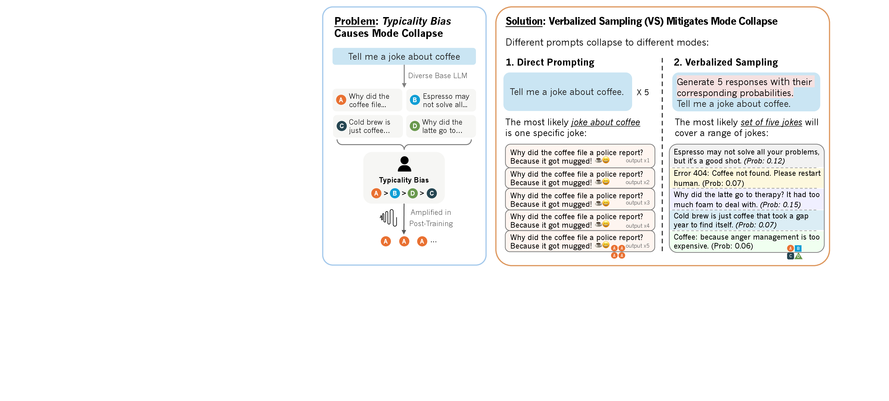

# Abstract

Reinforcement Learning from Human Feedback (RLHF) improves alignment but often reduces output diversity---a form of mode collapse. We identify a data-level driver: a typicality component in human preferences (favoring familiar, fluent, schema-consistent text) that, under a standard KL-regularized objective, provably sharpens the reference policy and compresses probability mass toward stereotypical completions on semantic plateaus. Motivated by a view of prompting as constrained reporting, in which point prompts return a mode whereas distribution prompts recover the model's latent predictive distribution, we introduce **Verbalized Sampling (VS)**: a simple, training-free prompting strategy that asks the model to output a small set of candidates with associated probabilities. This reframes instance queries as distributional ones and bypasses typicality-induced collapse. VS is model-agnostic and requires no access to logits. Across creative writing (poems, stories, jokes), multi-turn social dialogue simulation, and open-ended QA, VS increases diversity and produces broader, less-skewed answer distributions, while maintaining factual accuracy on commonsense reasoning tasks; we also observe that larger and reasoning-focused models benefit more. Overall, this work provides both a theoretical account of typicality-driven mode collapse and a practical, inference-time remedy that unlocks the base model's latent generative diversity.

## Research Overview

_Figure: The introductory teaser showing how typicality bias in preference data causes mode collapse, and how Verbalized Sampling (VS) provides a solution to improve diversity._
