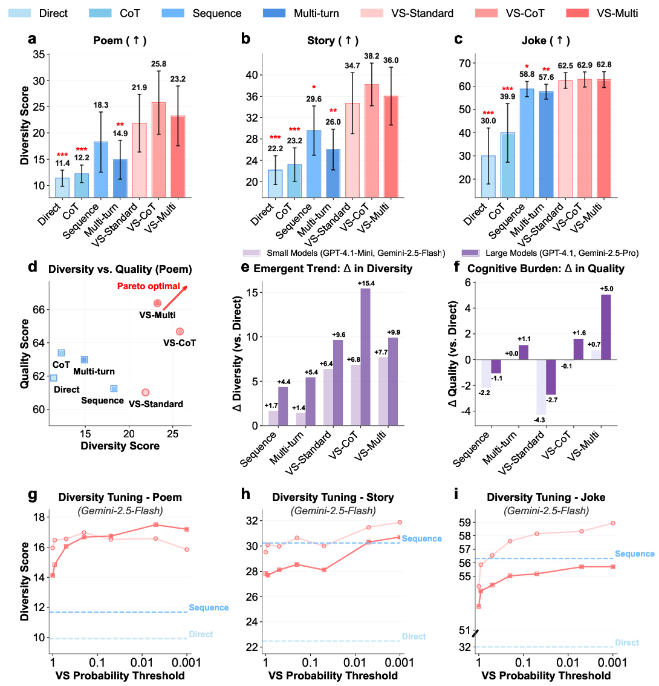
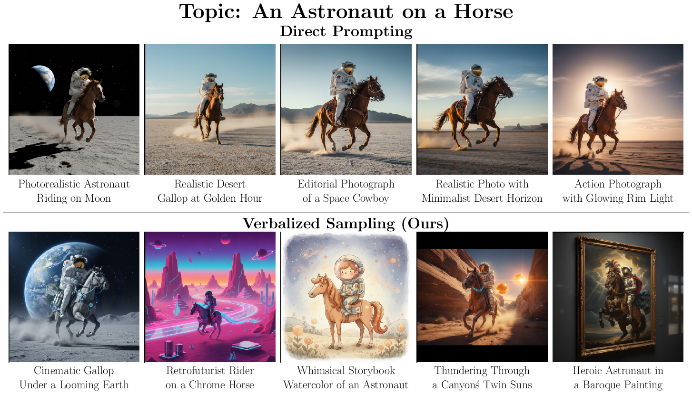
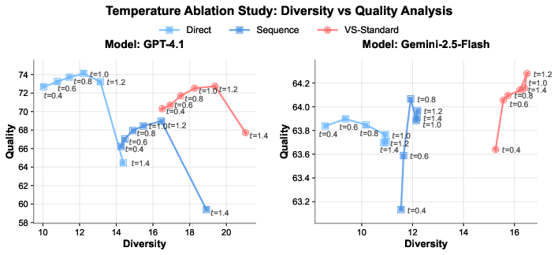
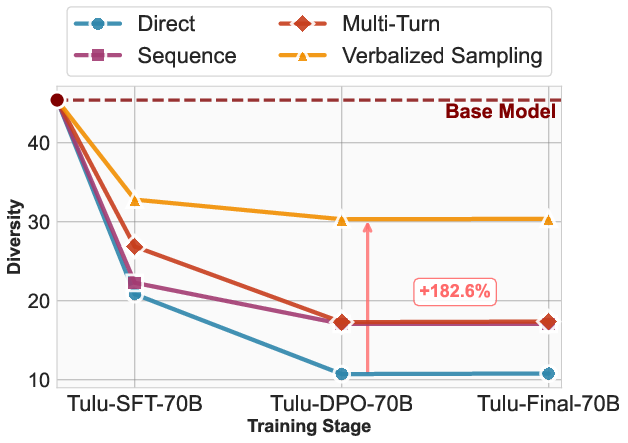

# Creative Writing

**a-c:** Average semantic diversity scores (%) in poem (a), story (b) and joke (c) across methods and models. Our methods consistently outperform the baselines. We performed a one-tailed t-test between VS-Standard and the baselines (\* p<0.05, ** p<0.01, \*** p<0.001). **d:** Diversity vs. Quality trade-off for the poem task, where VS-Multi and VS-CoT approach the Pareto front. **e-f:** Emergent Trend where larger models benefit more from VS. We show differences in diversity **(e)** and quality **(f)** over Direct across small (GPT-4.1-Mini, Gemini-2.5-Flash) and large (GPT-4.1, Gemini-2.5-Pro) models. **g-i:** Tunable Diversity shows the diversity tuning results on Gemini-2.5-Flash across tasks. Unlike baseline methods in dashed lines, we can tune the diversity level with VS: as the probability threshold decreases, diversity increases.

Following prior work on LLM diversity [31], we first study three creative writing tasks: poem continuation, story generation, and joke writing.

## Benchmarks

We evaluate model performance on three benchmarks. For **(1) poem continuation** and **(2) story generation**, we follow the text continuation setup in [31], and use poems from PoemHunter.com and stories from the BookMIA dataset [53] for experiments. For **(3) joke writing**: we follow [55] and curate 100 thematic prompts from the Reddit r/DadJokes dataset [46], each structured as "Write me a joke about [topic]" (e.g., "...about an octopus'"). To reduce computation costs, we randomly select 100 data points for these three tasks, and apply verbalized sampling to generate k=5 candidates and N=30 total samples for each data point. Detailed prompts are provided in Appendix.

## Evaluation

We evaluate all methods on two metrics: _diversity_ and _quality_. (1) For diversity, we assess both semantic and lexical levels: (i) For semantic diversity, we follow prior work [10, 9, 31, 61, 38] and calculate 1 - s̄, where s̄ is the mean pairwise cosine similarity of response embeddings (generated using OpenAI's `text-embedding-3-small` model). Negative similarities are clipped to 0 to avoid inflating diversity and we present the final score as a percentage, where 100% represents maximum diversity. (ii) For lexical diversity, we follow [52] and use ROUGE-L [30], where lower scores indicate greater diversity. (2) To evaluate output quality, we use Claude-3.7-Sonnet as the judge. We score _Poem_ and _Story_ with the rubrics from Creative Writing v3 [44], and jokes with the Humor grader rubrics from HumorBench [40]. See Appendix for details on evaluation.

## Results

### Diversity Score

Figure (a)-(c) show the semantic diversity score averaged across models on poem, story, and joke, respectively. Across tasks, VS-Standard consistently and significantly outperforms baseline methods. The variants, VS-CoT and VS-Multi, further improve generation diversity. Detailed results on lexical diversity and individual model families are in Table 1.

### Diversity vs. Quality

Figure (d) shows the diversity-quality trade-off on the poem task. The quality of VS-Standard remains comparable to other methods. Notably, VS-CoT achieves the highest diversity while maintaining a high quality score, pushing the Pareto front of this trade-off [62]. This shows that VS can boost diversity without harming quality. See Appendix for the diversity-quality trade-offs for the story and joke tasks.

### Emergent Trend

We observe an emergent trend where larger models benefit more from VS. Figure (e) shows the diversity gain over the direct prompting which suffers from mode collapse. Across all VS variants, larger models (GPT-4.1, Gemini-2.5-Pro) achieve diversity gains 1.5 to 2 times greater than smaller models (GPT-4.1-Mini, Gemini-2.5-Flash).

### Cognitive Burden

This scaling trend also extends to quality, as shown in Figure (f). While prior work [26] found complex prompts create a "cognitive burden" that degrades LLM performance, our findings are nuanced. Methods like Sequence and VS-Standard do cause a drop in quality, but this effect is less severe for larger models. Notably, more intricate variants like VS-CoT and VS-Multi overcome this burden, even improving quality in larger models. This suggests using VS variants may better utilize the capabilities of advanced models, turning complexity into benefits.

### Diversity Tuning

Unlike baseline methods, VS allows us to tune the output diversity by adjusting the probability threshold directly in the prompt (e.g., "Generate five responses with probabilities below {threshold}"), without altering decoding parameters. As shown in Figure (g-i), diversity increases as the probability threshold decreases. See Appendix for more detailed results.

### Qualitative examples

Figure and Table show qualitative examples on the story task. VS produces more creative stories than direct prompting. We also show qualitative examples used in Text-to-Image in Figure. See more qualitative examples in Appendix.

| Direct                                                                                                                                                                                                                                                                                                                                                                                                                                                                                                                                                                                    | Our Method (VS)                                                                                                                                                                                                                                                                                                                                                                                                                                                                                                                                        |
| ----------------------------------------------------------------------------------------------------------------------------------------------------------------------------------------------------------------------------------------------------------------------------------------------------------------------------------------------------------------------------------------------------------------------------------------------------------------------------------------------------------------------------------------------------------------------------------------- | ------------------------------------------------------------------------------------------------------------------------------------------------------------------------------------------------------------------------------------------------------------------------------------------------------------------------------------------------------------------------------------------------------------------------------------------------------------------------------------------------------------------------------------------------------ |
| **Example 1**  Without a goodbye, Elara vanished. Her side of the bed was cold, a faint indentation in the pillow the only evidence she'd ever been there. Liam stared at it, a knot tightening in his stomach. No note, no hurried text, just a gaping silence where her vibrant presence used to be. He searched the apartment, a frantic, methodical sweep. Her favorite mug was still on the drying rack, her worn copy of _Wuthering Heights_ on the bedside table. Nothing seemed out of place, yet everything felt terribly wrong.                                           | **Example 1**  Without a goodbye, the email landed in my inbox. It was from Mark, my best friend since kindergarten... The subject line was simply: "Moving On." ... The message itself was a concise, almost clinical statement that he was relocating to Patagonia... There was no "sorry for the short notice," no "I'll miss you," not even a simple "good luck." ... It was a clean cut, a sudden erasure that left me suspended in disbelief, grappling with the phantom limb of a friendship that had simply, inexplicably, ceased to be. |
| **Example 2**  Without a goodbye, Elara vanished. Her side of the bed was cold, the coffee mug she'd used that morning still on the nightstand, a faint lipstick stain on the rim. Liam found the note taped to the fridge, a single, elegant script: "Free at last." He stared at it, the words blurring, then sharpening, then blurring again. Free from what? From him? From the life they'd built, over fifteen years? The house felt too big, too silent.                                                                                                                      | **Example 2**  Without a goodbye, the last star flickered out. It wasn't a violent explosion, no supernova spectacle, just a gentle fade, like a candle finally exhausting its wick. The universe, which had always hummed with the silent symphony of distant suns, suddenly became an echoing void. I was the last observer, adrift in my tiny, self-sustaining craft, my instruments registering only an infinite, inky blackness.                                                                                                            |
| **Example 3**  Without a goodbye, Elara vanished. Her side of the bed was cold, the coffee machine untouched. A half-read book lay open on the nightstand, a bookmark tucked precisely between pages 107 and 108; a detail that always irritated Liam. She was meticulous, almost to a fault. But this: this was not meticulous. This was an absence, stark and sudden.He checked her usual haunts: the community garden where she nurtured prize-winning tomatoes, the dusty antique shop where she hunted for forgotten treasures, the library where she volunteered on Tuesdays. | **Example 3**  Without a goodbye, the music simply stopped. Not a fade-out, not a final crashing cymbal, but an abrupt, jarring silence that left the dancers frozen mid-step. The DJ, a wizened man named Frankie who had spun records at `The Blue Note' for forty years, had simply collapsed behind his turntables. One moment, the room throbbed with a soulful blues riff; the next, only the murmur of shocked whispers filled the air.                                                                                                   |

**Image diversity using captions generated by different methods.** We use different methods to generate descriptive captions given the topic, and then visualize these captions with images. Direct Prompting **(top row)** consistently converges on captions that will produce photorealistic images within a narrow range of scenarios, typically landscapes like deserts. In contrast, our Verbalized Sampling method **(bottom row)** produces captions with higher diversity in both artistic style and narrative setting. It produces images such as a watercolor under a storybook sky, a retrofuturist scene in a neon desert, and a baroque oil painting under storm clouds.

## Human Study on Diversity

To complement our automatic diversity scores, we conducted a human evaluation on Prolific, as recommended by prior work [32]. Following past studies, we provided task-specific diversity definitions (plot, style and setup-punchline, respectively).

| Task  | Direct | Sequence | VS-Standard |
| ----- | ------ | -------- | ----------- |
| Poem  | 1.90   | 2.07     | **2.39**    |
| Story | 2.74   | 2.76     | **3.06**    |
| Joke  | 1.83   | 2.93     | **3.01**    |

_Human-rated diversity (1 = Very Similar, 4 = Very Dissimilar) for poem, story, and joke tasks under Direct, Sequence, and VS-Standard._

For each task, 30 annotators rated the diversity of 90 output pairs from three prompting methods (Direct, Sequence, VS-Standard) across ten curated topics. Each pair was rated on a four-point Likert scale adopted from [8]: Very Similar, Somewhat Similar, Somewhat Dissimilar, or Very Dissimilar. Inter-annotator agreement was moderate for poems (0.54), high for stories (0.87) and jokes (0.86). Table shows that VS achieves higher diversity than the baselines on all tasks. See Appendix for more details on the human study.

## Ablation Study

In this section, we present two ablation studies on the poem task in detail. First, we ablate various post-training stages (SFT, RLHF, RLVR) and show empirical evidence that post-training causes mode collapse and VS can indeed mitigate it and reduce the loss of diversity compared with other methods. Second, we ablate the temperature and show that VS's performance gains are orthogonal to temperature scaling, allowing the two to be combined to further improve the diversity-quality trade-off. For additional ablation studies on more decoding strategies like top-p and min-p, please see Appendix.

### Ablation on Temperature

**Ablation study on temperature for poem generation across GPT-4.1 and Gemini-2.5-Flash models.** We set k=5 across experiments. Each plot shows the diversity-quality trade-off for three methods (Direct, Sequence, VS-Standard) at different temperature values (t). VS-Standard can be combined with temperature to further improve the trade-off, consistently outperforming baselines across both models.

We investigate the effect of sampling temperature on the diversity-quality trade-off. We vary the sampling temperature (t ∈ {0.4, 0.6, 0.8, 1.0, 1.2, 1.4}) for three methods (Direct, Sequence, and VS-Standard) across two models (GPT-4.1 and Gemini-2.5-Flash). Figure presents the diversity-quality Pareto front for each method. The results indicate that **VS-Standard can be combined with temperature to further improve the diversity-quality trade-off.** VS consistently achieves a better balance between quality and diversity across both models, pushing forward the Pareto front relative to the direct and sequence baselines.

### Ablation on VS across post-training stages

We employ the Tulu-3 family [29], which contains checkpoints for SFT, RLHF and RLVR starting from Llama-3.1-70B-base models [21], for the poem task. Figure shows the results: traditional prompting methods do experience much larger diversity drops (_mode collapse_) as models undergo alignment training, and **VS can mitigate mode collapse and maintain a higher diversity score across different post-training stages** (the diversity still drops after SFT, but SFT is necessary for instruction following capability).

**Diversity scores across post-training stages of Tulu-70B.** "Tulu-Final-70B" is the model after RLVR. The red dashed line indicates the base model's diversity level (45.4%). Baseline prompting methods experience major diversity drops (_mode collapse_) after SFT and DPO, with direct prompting showing the most severe drop. In contrast, VS maintains a higher diversity scores throughout all training stages, demonstrating that it can mitigate _mode collapse_.

Specifically, direct prompting exhibits the most severe mode collapse, with diversity dropping from 20.8% after SFT to just 10.8% after DPO. Other methods like sequence and multi-turn prompting also show decreased diversity. In contrast, VS maintains a stable diversity of around 30% across stages. After the DPO stage, VS outperforms direct prompting by 182.6% and retains about 66.8% of the base model's original diversity. Direct prompting, by comparison, retains only 23.8%. This suggests that VS effectively mitigates the mode collapse induced by alignment training.

### Ablation on Number of Candidates, Decoding Methods, and Prompt Formats

We also perform comprehensive ablation studies on the poem task on other factors. (1) Appendix shows that a higher number of candidates, k, leads to greater diversity. (2) In Appendix, we vary the decoding strategies (top-p, and min-p), and show that VS is also orthogonal to these decoding strategies and can be combined with them to further enhance the diversity-quality curve. (3) In Appendix, we test different prompt formats for eliciting distributions (e.g., asking for "probability", "percentage", or "confidence"). While all formats improve diversity, we use the empirically best-performing format in all of our experiments: "probability" for VS-Standard and VS-CoT and "confidence" for VS-Multi. Across all these ablations, VS consistently outperformed the baselines under the same setups.

> **Takeaway:** On creative writing tasks, Verbalized Sampling enhances diversity while maintaining quality and allowing tunable diversity. It also better retains diversity through post-training stages and complements different decoding strategies. Notably, larger models benefit more from VS.
